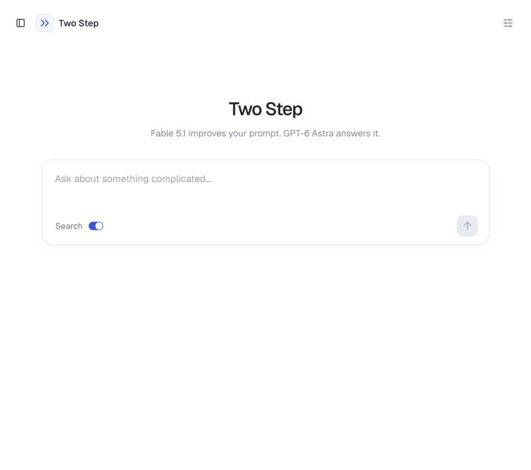

# Two Step

Two Step is an AI chat app that improves your prompt before answering it. The idea is to get more useful answers without having to figure out how to write a good prompt yourself.

Ask a question or describe what you need in your own words. The app then:

1. Uses **Fable 5.1** to turn your message into a clearer request, keeping your intent and relevant conversation context.
2. Sends that request to **GPT-6 Astra** to produce the answer.

You can inspect the rewritten prompt to see what changed and keep chatting to follow up.



Type a message to start. Use **Settings** to change either model or its instructions, and turn **Search** on when you want web search. Chats are saved in your browser.

## Run locally

You need Node.js 22.18+ and an OpenRouter API key.

```sh
npm install
export OPENROUTER_API_KEY="your-key-here"
npm run dev
```
